# Лабораторная работа 2

## Теоретические сведения.

В работе рассматривается 2 алгоритма поиска шаблона на изображение:

**Template Matching** - это метод обработки цифровых изображений для поиска небольших частей изображения, которые соответствуют изображению-шаблону. 

Масштабно-инвариантное преобразование признаков (**SIFT**) — это алгоритм компьютерного зрения для обнаружения, описания и сопоставления локальных особенностей изображений. 

**Классические дескрипторы признаков (SIFT)** обычно сравниваются и сопоставляются с использованием евклидова расстояния (или L2-нормы). Поскольку дескрипторы SIFT представляют собой гистограмму ориентированного градиента (отклика вейвлета Хаара для SURF) в окрестности, альтернативами евклидову расстоянию являются метрики на основе гистограммы (х2, Расстояние движения Земли (EMD), ...).

## Описание разработанной системы

1.	**Template Matching** – алгоритм сворачивает каждый пиксель исходного изображения с шаблоном и возвращает карту вероятностей совпадений шаблона в каждом пикселе. После сего достаточно нарисовать рамку в пикселе с наибольшей вероятностью. 
```python
def process_image_MT(in_img, template):
    w, h = template.shape[::-1]
    res = cv.matchTemplate(in_img,template,cv.TM_CCOEFF_NORMED)
    _, _, _, max_loc = cv.minMaxLoc(res)
    return max_loc, (max_loc[0] + w, max_loc[1] + h) 
```
2.	**Feature Matching SIFT** – алгоритм с начала находи ключевые точки на изображение и шаблоне используя алгоритм SIFT, получая координаты точек и их дескрипторы. Затем сопоставляются дескрипторы на обоих изображения используя метод ближайших соседей и список ключевых точек фильтруется по расстоянию между соседями. 
В этом алгоритме также есть несколько гиперпараметров меня который можно получать разные результаты поиска:
MIN_MATCH_COUNT = 8	- минимальное количество точек для работы;
MAX_DISTANCE = 0.65	- максимальная дистанция по которой происходит отбор точек.
Рамка стоится между крайней правой верхней и нижней левой точкой.
```python
def process_image_SIFT(img1, img2):
    MIN_MATCH_COUNT = 8
    MAX_DISTANCE = 0.65
    sift = cv.SIFT_create()
    kp1, des1 = sift.detectAndCompute(img1,None)                # Здесь kp будет списком ключевых точек, а des — масивом формата numpy.(Количество ключевых точек) × 128
    kp2, des2 = sift.detectAndCompute(img2,None)
    FLANN_INDEX_KDTREE = 1
    index_params = dict(algorithm = FLANN_INDEX_KDTREE, trees = 5) # Выбор алгоритма для sift
    search_params = dict(checks = 50)                           # Количество обходов дерева 
    flann = cv.FlannBasedMatcher(index_params, search_params)   # (FLANN) Быстрая библиотека для приближенных ближайших соседей
    matches = flann.knnMatch(des1,des2,k=2)                     # Возвращает к пар лучших совпадений для каждой точки   

    good = []
    for m,n in matches:
        if m.distance < MAX_DISTANCE*n.distance:         # distance - Расстояние(метрика) между дескрипторами
            good.append(m)     
            
    if len(good) >= MIN_MATCH_COUNT:
        src_pts = np.float32([ kp1[m.queryIdx].pt for m in good ]).reshape(-1,1,2)  # queryIdx - Index of the descriptor in query descriptors
        dst_pts = np.float32([ kp2[m.trainIdx].pt for m in good ]).reshape(-1,1,2)  # trainIdx — Index of the descriptor in train descriptors
        _, mask = cv.findHomography(src_pts, dst_pts, cv.RANSAC,5.0)     # Отбрасывает выбросы на изображении 
         
        pts = src_pts[mask==1]
        min_x, min_y = np.int32(pts.min(axis=0))
        max_x, max_y = np.int32(pts.max(axis=0))  
        return (min_x, min_y), (max_x,max_y)

    else:
        raise Exception("Not enough matches are found - {}/{}".format(len(good), MIN_MATCH_COUNT))
 ```

В обеих реализациях функции работают с изображениями в оттенках серого, такова специфика выбранной библиотеки.
Обе функции возражают координаты рамки на изображение, а затем рамка строится функцией cv.rectangle.

Для **GUI** используется графическая библиотека PyQt5. 
GUI позволяет выбрать способ обработки алгоритм поиска и и пару шаблон-изображение. При смене алгоритма поиска или пары шаблон-изображение производится поиск и выводится результат в окно. В статус бар выводиться сообщения в случае возникновения ошибки при поиске. В левой части окна выводится изображение с рамкой и в правой шаблон.

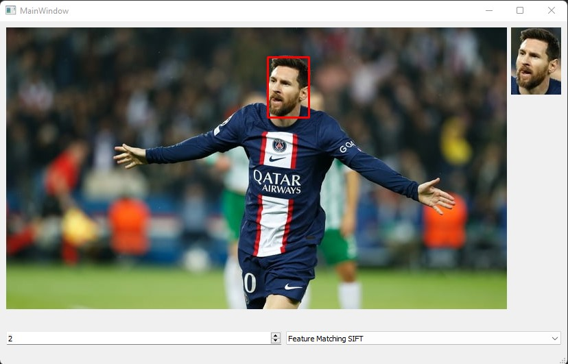

## Результаты работы и тестирования системы 

Шаблоны были получены путём вырезания из исходного изображения:

Template Matching:


Feature Matching SIFT: 


Template Matching:

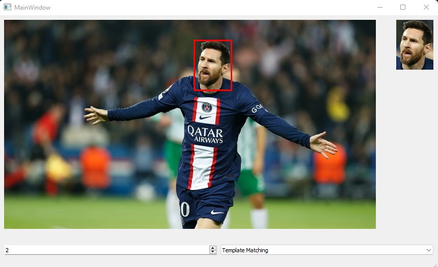
Feature Matching SIFT:


Как можно заметить оба алгоритма успешно справляются с поставленной задачей.

____

Теперь рассмотри вариант без поворота шаблона и с незначительным поворотом.

Template Matching:


Feature Matching SIFT: 

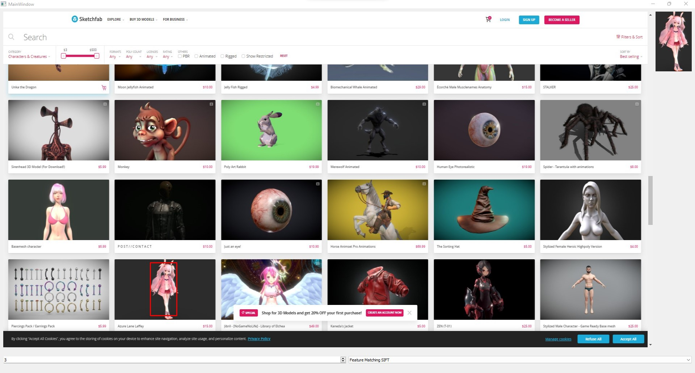

Template Matching:

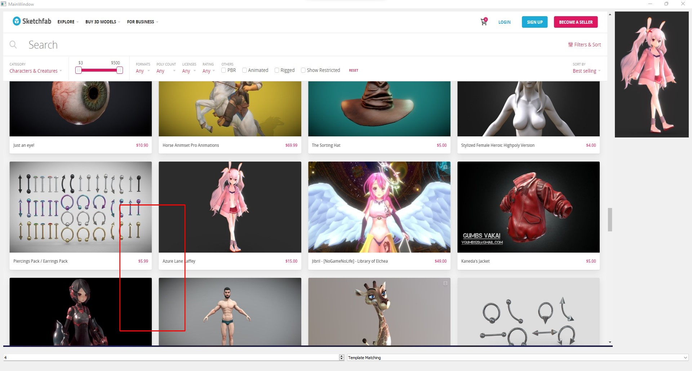
Feature Matching SIFT:

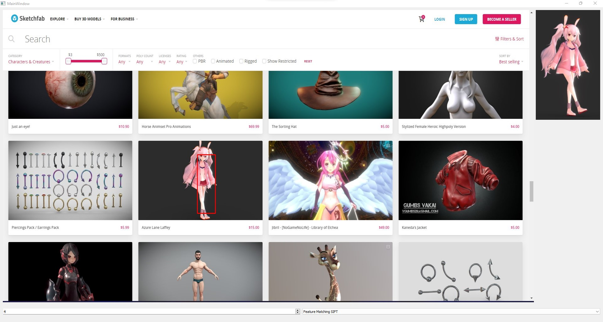

Как можно заметить без поворота обе функции успешно справляются с задачей, а при повороте алгоритм Template Matching выдаёт ошибочное значение, а Feature Matching SIFT относительно верный. 

____

Рассмотрим изображения с изменённым освещение:

Template Matching:

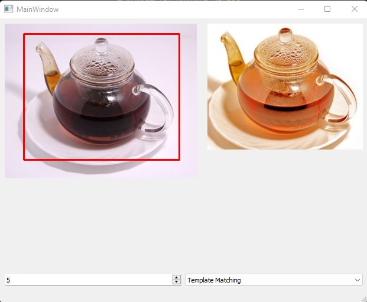

Feature Matching SIFT: 

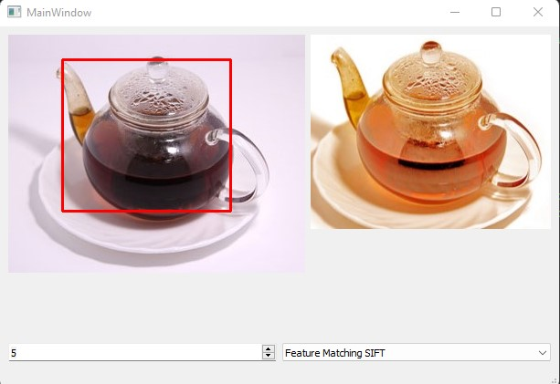

Как можно заметить оба алгоритма успешно справилась, возможно из-за отсутствия окружения у объекта.

____

Пример с разным размещение источника света:

Template Matching:

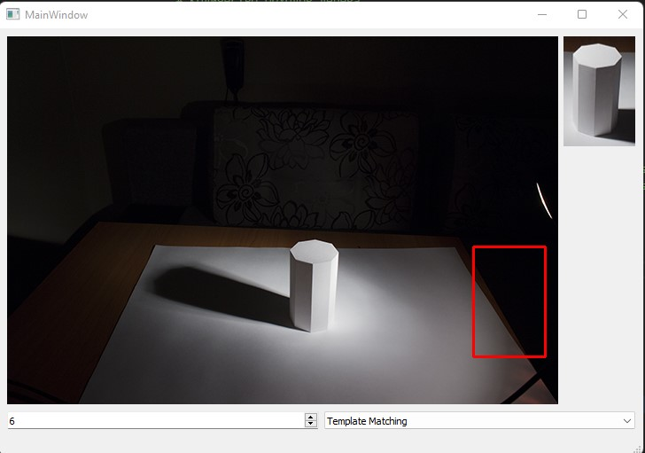

Feature Matching SIFT: 

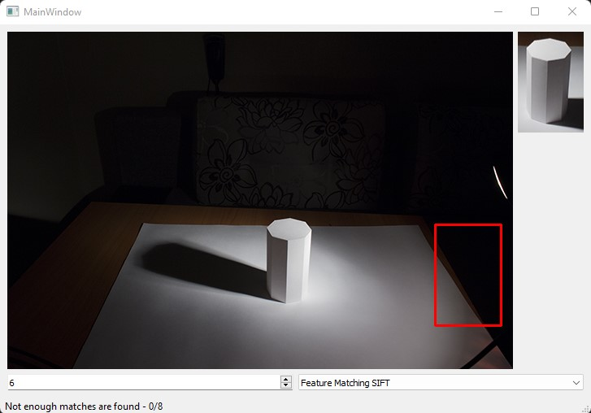

Как можно заметить первый алгоритм ошибочно определил расположение объекта, а второй не нашёл достаточно точек и выдал ошибку.
____

Пример с немного деформированным шаблоном. 

Template Matching:

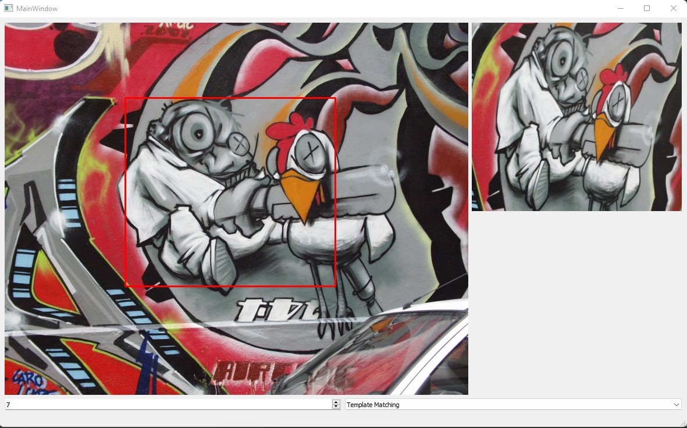

Feature Matching SIFT: 


Как можно заметить оба алгоритма справились, но второй дам большую рамку, из-за насыщенности фона. 

Если посмотреть на саапределение точек то видно что алгоритм учёл изменение маштаба изображения:

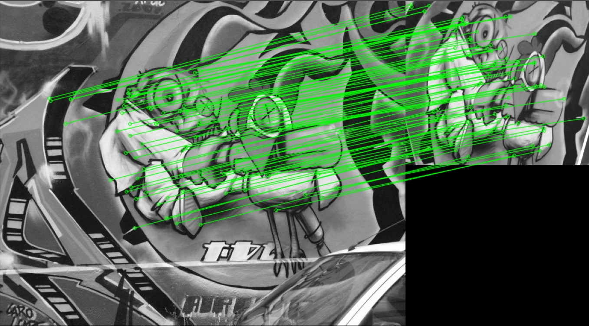
____

Пример, где одновременно меняется освещение, направление освещения, ракурс и размер изображения. 

Template Matching:

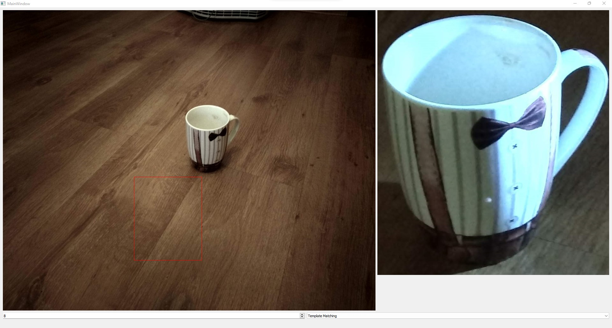

Feature Matching SIFT: 


Как можно заметить первый алгоритм ошибочно определил расположение объекта, а второй смог распознать узор на кружке и постол рамку на нём. 
Если посмотреть как распределились точки:

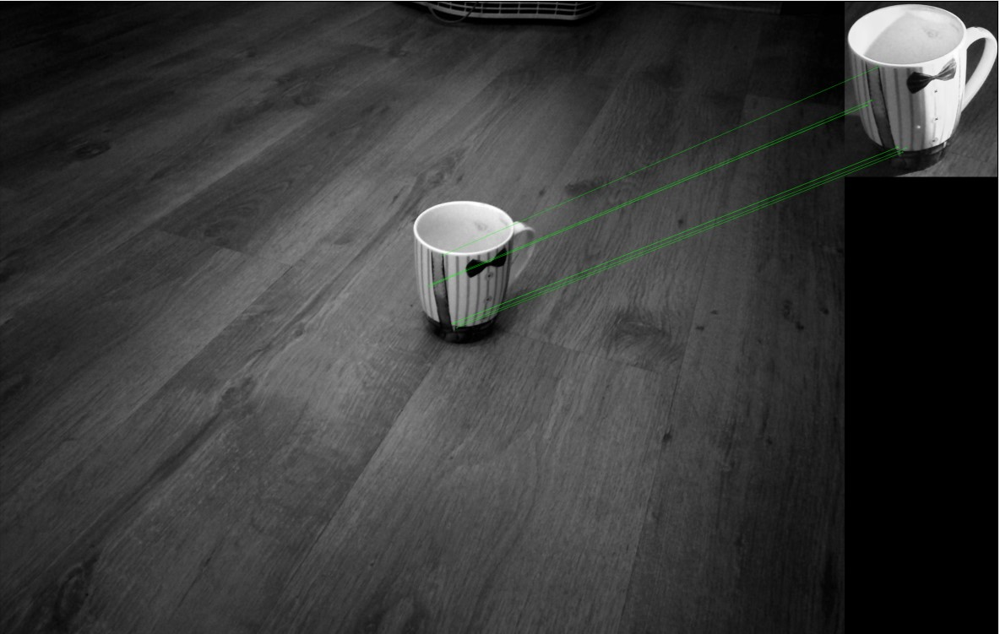

____

Template Matching:


Feature Matching SIFT: 


Template Matching:

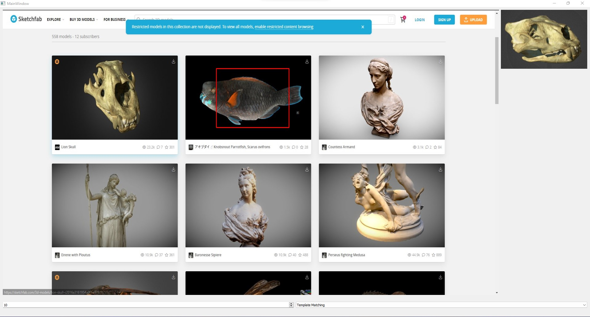

Feature Matching SIFT: 


Как можно заметить первый алгоритм ошибочно определил расположение объекта, а второй не нашёл достаточное количество точек.


## Выводы по работе
В лабораторной работе был реализован детектор объекта на изображении двумя разними способами: прямой поиск одного изображения на другом и поиск ключевых точек эталона на входном изображении. Произведено тестирование и сравнение результатов работы алгоритмов на тестовых изображения. Оба алгоритма хорошо себя показывают при поиске точного шаблона на изображении, алгоритм поиска по ключевым точкам работает лучше первого алгоритма в случае искажения шаблона(изменения освещения, ракурса и т.п.), но требователен к точной настройке параметров в то время как алгоритм  поиск одного изображения на другом не требует дополнительной настройки. 

## Источники 
- https://docs.opencv.org/4.x/d4/dc6/tutorial_py_template_matching.html
- https://docs.opencv.org/4.x/dc/dc3/tutorial_py_matcher.html
- https://docs.opencv.org/3.4/d1/de0/tutorial_py_feature_homography.html
- https://docs.opencv.org/4.x/da/df5/tutorial_py_sift_intro.html
- https://towardsdatascience.com/improving-your-image-matching-results-by-14-with-one-line-of-code-b72ae9ca2b73
- https://docs.opencv.org/3.4/d5/d6f/tutorial_feature_flann_matcher.html
- https://sketchfab.com

